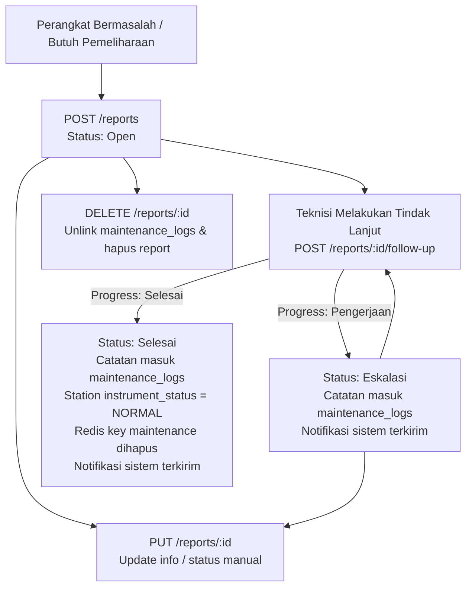

# Kontrak API — Modul Laporan & Tindak Lanjut Perbaikan (Maintenance Reports)

Base URL: `/reports`  
Header Autentikasi: `Authorization: Bearer <access_token>`  
Role Akses: `adm` (Admin) dan `eng` (Engineer).

---

## 1. Ikhtisar Alur Bisnis (Business Workflow)

Modul Reports mengelola siklus perbaikan perangkat/stasiun IoT dari identifikasi masalah hingga normalisasi instrumen:



### Aturan Status dan Normalisasi Otomatis:
1. **Status Laporan (`reports.status`)**:
   - `Open`: Laporan baru dibuat, belum ada penanganan teknisi.
   - `Eskalasi`: Sedang dalam investigasi atau pengerjaan perbaikan.
   - `Selesai`: Perbaikan telah tuntas dan instrumen kembali beroperasi normal.
2. **Saat status mencapai `Selesai` pada `follow-up`**:
   - Tabel `stations.instrument_status` diubah otomatis menjadi `'NORMAL'`.
   - Key Redis lock `maintenance:<station_uuid>` dihapus agar stasiun kembali aktif dalam pemantauan realtime.
   - Entri riwayat pengerjaan di `maintenance_logs` dicatat dengan status `'start'` dan progress `'Selesai'`.
   - Notifikasi broadcast sistem dikirimkan dengan kategori `maintenance` dan tipe `logbook`.
3. **Saat Laporan Dihapus (`DELETE`)**:
   - Relasi riwayat `maintenance_logs.report_id` dilepas menjadi `null` (soft unlink) agar riwayat logbook operasional mesin tidak hilang.
   - Data laporan di tabel `reports` dihapus permanen.

---

## 2. Ringkasan Endpoint

| Method | Endpoint | Role | Deskripsi |
| :--- | :--- | :--- | :--- |
| `GET` | `/reports` | `adm`, `eng` | Mendapatkan daftar laporan dengan filter dan paginasi |
| `GET` | `/reports/:id` | `adm`, `eng` | Mendapatkan detail laporan beserta seluruh riwayat pengerjaan (`history`) |
| `POST` | `/reports` | `adm`, `eng` | Membuat laporan perbaikan baru (status awal `'Open'`) |
| `PUT` | `/reports/:id` | `adm`, `eng` | Memperbarui data umum atau status laporan |
| `POST` | `/reports/:id/follow-up` | `adm`, `eng` | Mencatat tindak lanjut perbaikan, update status, dan normalisasi stasiun |
| `DELETE` | `/reports/:id` | `adm`, `eng` | Menghapus laporan dan melepaskan relasi log pengerjaan |

---

## 3. Spesifikasi Detail Endpoint

### 3.1. Daftar Laporan (List Reports)
`GET /reports`

Mengambil daftar laporan dengan dukungan filter `station_uuid`, `status`, dan paginasi.

#### Query Parameters:
| Parameter | Tipe | Wajib | Keterangan |
| :--- | :--- | :--- | :--- |
| `station_uuid` | string | Tidak | Filter berdasarkan kode stasiun / mesin (contoh: `AWS-ST-001`) |
| `status` | string | Tidak | Filter status: `Open`, `Eskalasi`, `Selesai` |
| `limit` | integer | Tidak | Jumlah item per halaman (default: `20`) |
| `offset` | integer | Tidak | Lewati N item pertama (default: `0`) |

#### Contoh Request:
`GET /reports?status=Open&limit=10&offset=0`

#### Contoh Respons Sukses (200 OK):
```json
{
  "success": true,
  "data": [
    {
      "id": 1,
      "title": "Sensor Turbidity Out of Range",
      "station_uuid": "AWS-ST-001",
      "description": "Nilai turbidity melebihi baku mutu batas atas",
      "pic_id": 10,
      "pic_name": "febry",
      "category": "Perbaikan",
      "status": "Open",
      "created_at": "2026-08-27 10:00:00",
      "updated_at": "2026-08-27 10:00:00"
    }
  ],
  "total": 1
}
```

---

### 3.2. Detail Laporan & Riwayat Pengerjaan (Report Detail with History)
`GET /reports/:id`

Mengambil rincian data laporan tertentu beserta daftar log pengerjaan/tindak lanjut yang terhubung.

#### Path Parameters:
- `id` (integer/string, wajib): ID laporan.

#### Contoh Respons Sukses (200 OK):
```json
{
  "success": true,
  "data": {
    "id": 1,
    "title": "Sensor Turbidity Out of Range",
    "station_uuid": "AWS-ST-001",
    "description": "Nilai turbidity melebihi baku mutu batas atas",
    "action_description": "Probe dibersihkan dari lumut dan sedimen",
    "pic_id": 10,
    "pic_name": "febry",
    "category": "Perbaikan",
    "status": "Eskalasi",
    "allowed_statuses": ["Open", "Eskalasi", "Selesai"],
    "created_at": "2026-08-27 10:00:00",
    "updated_at": "2026-08-27 11:30:00",
    "history": [
      {
        "id": 25,
        "uuid": "AWS-ST-001",
        "status": "maintenance",
        "activity_type": "Pembersihan Probe",
        "description": "Probe dibersihkan dari lumut dan sedimen",
        "progress": "Pengerjaan",
        "report_id": 1,
        "photo_url": "https://storage.example.com/photos/probe-clean.jpg",
        "created_by": "febry",
        "created_at": "2026-08-27 11:30:00"
      }
    ]
  }
}
```

#### Respons Error:
- `404 Not Found`:
  ```json
  {
    "success": false,
    "message": "Report not found"
  }
  ```

---

### 3.3. Buat Laporan Baru (Create Report)
`POST /reports`

Membuat laporan perbaikan baru. Status otomatis diatur ke `'Open'` (atau dapat diatur awal melalui parameter `status`). Identitas pelapor (`pic_id` dan `pic_name`) otomatis diisi dari JWT token pengguna yang melakukan request.

#### Request Body:
| Field | Tipe | Wajib | Keterangan |
| :--- | :--- | :--- | :--- |
| `title` | string | **Ya** | Judul permasalahan |
| `station_uuid` | string | **Ya** | Kode identifier stasiun / mesin |
| `category` | string | **Ya** | Kategori masalah (contoh: `Perbaikan`, `Penggantian Part`) |
| `description` | string | Tidak | Keterangan rinci kondisi kerusakan awal |
| `action_description` | string | Tidak | Deskripsi awal tindakan perbaikan (alias: `deskripsi_tindakan`) |
| `status` | string | Tidak | Status awal: `Open` (default), `Eskalasi`, `Selesai` |

#### Contoh Request:
```json
{
  "title": "Sensor pH Unstable",
  "station_uuid": "AWS-ST-001",
  "category": "Perbaikan",
  "description": "Sensor membaca fluktuasi tajam antara pH 2 hingga 12",
  "action_description": "Pemeriksaan kabel sambungan elektroda pH",
  "status": "Eskalasi"
}
```

#### Contoh Respons Sukses (200 OK):
```json
{
  "success": true,
  "message": "Report created successfully",
  "data": {
    "id": 2,
    "title": "Sensor pH Unstable",
    "station_uuid": "AWS-ST-001",
    "description": "Sensor membaca fluktuasi tajam antara pH 2 hingga 12",
    "action_description": "Pemeriksaan kabel sambungan elektroda pH",
    "pic_id": 10,
    "pic_name": "febry",
    "category": "Perbaikan",
    "status": "Eskalasi",
    "created_at": "2026-08-27 14:00:00",
    "updated_at": "2026-08-27 14:00:00"
  }
}
```

#### Respons Error:
- `400 Bad Request`:
  ```json
  {
    "success": false,
    "message": "Title, Station UUID, and Category are required"
  }
  ```

---

### 3.4. Perbarui Laporan & Ubah Status (Update Report & Change Status)
`PUT /reports/:id`

Memperbarui judul, deskripsi awal, deskripsi tindakan (`action_description` / `deskripsi_tindakan`), kategori, pengaturan status (`status`), atau PIC laporan.
Jika status diubah atau `action_description` diisi, sistem otomatis mencatat entri log pengerjaan di `maintenance_logs`. Jika status diubah menjadi `'Selesai'`, stasiun otomatis dinormalisasi.

#### Request Body:
| Field | Tipe | Wajib | Keterangan |
| :--- | :--- | :--- | :--- |
| `title` | string | Tidak | Judul laporan baru |
| `description` | string | Tidak | Deskripsi awal masalah baru |
| `action_description` | string | Tidak | **Deskripsi tindakan perbaikan** yang dilakukan (alias: `deskripsi_tindakan`) |
| `category` | string | Tidak | Kategori baru (`Perbaikan`, `Penggantian Part`) |
| `status` | string | Tidak | **Pengaturan status laporan**: `Open`, `Eskalasi`, `Selesai` |
| `activity_type` | string | Tidak | Tipe aktivitas untuk logbook (default: `Pembaruan Tindakan Laporan`) |
| `pic_id` | integer | Tidak | **Hanya role Admin (`adm`)** yang diizinkan mengubah PIC |
| `pic_name` | string | Tidak | **Hanya role Admin (`adm`)** yang diizinkan mengubah PIC |

#### Contoh Request:
```json
{
  "status": "Selesai",
  "action_description": "Penggantian kapasitor pompa dan pembersihan nozzle selesai dilakukan. Alat beroperasi normal.",
  "activity_type": "Perbaikan Selesai"
}
```

#### Contoh Respons Sukses (200 OK):
```json
{
  "success": true,
  "message": "Report updated successfully",
  "data": {
    "id": 2,
    "title": "Sensor pH Unstable",
    "station_uuid": "AWS-ST-001",
    "description": "Sensor membaca fluktuasi tajam antara pH 2 hingga 12",
    "action_description": "Penggantian kapasitor pompa dan pembersihan nozzle selesai dilakukan. Alat beroperasi normal.",
    "pic_id": 10,
    "pic_name": "febry",
    "category": "Perbaikan",
    "status": "Selesai",
    "allowed_statuses": ["Open", "Eskalasi", "Selesai"],
    "created_at": "2026-08-27 14:00:00",
    "updated_at": "2026-08-27 14:15:00",
    "history": [
      {
        "id": 26,
        "uuid": "AWS-ST-001",
        "status": "start",
        "activity_type": "Perbaikan Selesai",
        "description": "Penggantian kapasitor pompa dan pembersihan nozzle selesai dilakukan. Alat beroperasi normal.",
        "progress": "Selesai",
        "report_id": 2,
        "created_by": "febry",
        "created_at": "2026-08-27 14:15:00"
      }
    ]
  }
}
```

#### Respons Error:
- `400 Bad Request` (status tidak valid):
  ```json
  {
    "success": false,
    "message": "Status must be one of: Open, Eskalasi, Selesai"
  }
  ```
- `403 Forbidden` (user non-admin mencoba ubah PIC):
  ```json
  {
    "success": false,
    "message": "Only Admin can change PIC"
  }
  ```
- `404 Not Found`:
  ```json
  {
    "success": false,
    "message": "Report not found"
  }
  ```

---

### 3.5. Tindak Lanjut Perbaikan (Follow-up Report)
`POST /reports/:id/follow-up`

Mencatat aktivitas tindak lanjut perbaikan stasiun, menyimpan deskripsi tindakan (`action_description`), memperbarui status laporan, serta melakukan normalisasi instrumen stasiun ketika perbaikan selesai.

#### Request Body:
| Field | Tipe | Wajib | Keterangan |
| :--- | :--- | :--- | :--- |
| `description` | string | **Ya** | Penjelasan aktivitas atau hasil tindakan perbaikan (alias: `action_description`, `deskripsi_tindakan`) |
| `action_description` | string | Tidak | Alias untuk `description` |
| `deskripsi_tindakan` | string | Tidak | Alias untuk `description` |
| `progress` | string | Tidak | Nilai: `'Pengerjaan'` atau `'Selesai'`. Menentukan status laporan (`'Eskalasi'` atau `'Selesai'`). Default: `'Pengerjaan'`. |
| `status` | string | Tidak | Nilai eksplisit: `'Open'`, `'Eskalasi'`, `'Selesai'`. |
| `activity_type` | string | Tidak | Jenis aktivitas (default: `'Tindak Lanjut Perbaikan'`) |
| `photo_url` | string | Tidak | URL gambar/foto dokumentasi pengerjaan |

#### Logika Penentuan Target Status:
- Jika `status` disertakan, divalidasi harus salah satu dari `['Open', 'Eskalasi', 'Selesai']`.
- Jika `progress` disertakan:
  * `progress: 'Pengerjaan'` $\rightarrow$ `status: 'Eskalasi'`
  * `progress: 'Selesai'` $\rightarrow$ `status: 'Selesai'`
- Jika hanya mengirimkan `description`:
  * `status: 'Eskalasi'`, `progress: 'Pengerjaan'`

#### Contoh Request 1: Progress Sedang Pengerjaan
```json
{
  "progress": "Pengerjaan",
  "activity_type": "Penggantian Kabel Sensor",
  "description": "Kabel transmisi RS485 diganti dengan yang baru, sedang tahap kalibrasi ulang",
  "photo_url": "https://storage.example.com/photos/cable-replace.jpg"
}
```

#### Contoh Request 2: Perbaikan Telah Selesai
```json
{
  "progress": "Selesai",
  "activity_type": "Kalibrasi & Uji Operasional",
  "description": "Kalibrasi sensor pH berhasil dengan nilai slope 98.5%. Pembacaan stabil.",
  "photo_url": "https://storage.example.com/photos/test-pass.jpg"
}
```

#### Contoh Respons Sukses (200 OK):
```json
{
  "success": true,
  "message": "Tindak lanjut laporan berhasil disimpan",
  "data": {
    "id": 2,
    "title": "Sensor pH Unstable",
    "station_uuid": "AWS-ST-001",
    "description": "Sudah dikonfirmasi dengan teknisi lapangan",
    "pic_id": 10,
    "pic_name": "febry",
    "category": "Perbaikan",
    "status": "Selesai",
    "created_at": "2026-08-27 14:00:00",
    "updated_at": "2026-08-27 14:35:00",
    "history": [
      {
        "id": 26,
        "uuid": "AWS-ST-001",
        "status": "start",
        "activity_type": "Kalibrasi & Uji Operasional",
        "description": "Kalibrasi sensor pH berhasil dengan nilai slope 98.5%. Pembacaan stabil.",
        "progress": "Selesai",
        "report_id": 2,
        "photo_url": "https://storage.example.com/photos/test-pass.jpg",
        "created_by": "febry",
        "created_at": "2026-08-27 14:35:00"
      },
      {
        "id": 25,
        "uuid": "AWS-ST-001",
        "status": "maintenance",
        "activity_type": "Penggantian Kabel Sensor",
        "description": "Kabel transmisi RS485 diganti dengan yang baru, sedang tahap kalibrasi ulang",
        "progress": "Pengerjaan",
        "report_id": 2,
        "photo_url": "https://storage.example.com/photos/cable-replace.jpg",
        "created_by": "febry",
        "created_at": "2026-08-27 14:20:00"
      }
    ]
  }
}
```

#### Respons Error:
- `400 Bad Request` (deskripsi kosong):
  ```json
  {
    "success": false,
    "message": "Description is required for follow-up"
  }
  ```
- `400 Bad Request` (status tidak valid):
  ```json
  {
    "success": false,
    "message": "Status must be one of: Open, Eskalasi, Selesai"
  }
  ```
- `404 Not Found`:
  ```json
  {
    "success": false,
    "message": "Report not found"
  }
  ```

---

### 3.6. Hapus Laporan (Delete Report)
`DELETE /reports/:id`

Menghapus laporan pemeliharaan. Jika terdapat riwayat logbook yang tertaut pada laporan ini, relasi `report_id` pada tabel `maintenance_logs` akan di-set menjadi `null` sehingga riwayat logbook stasiun tetap terjaga.

#### Path Parameters:
- `id` (integer/string, wajib): ID laporan yang akan dihapus.

#### Contoh Respons Sukses (200 OK):
```json
{
  "success": true,
  "message": "Laporan berhasil dihapus"
}
```

#### Respons Error:
- `404 Not Found`:
  ```json
  {
    "success": false,
    "message": "Report not found"
  }
  ```

---

## 4. Format Error Response Standar

Semua kegagalan API mengembalikan format respons terpadu:
```json
{
  "success": false,
  "message": "<Pesan kesalahan deskriptif>"
}
```
Atau jika disertai kode error teknis:
```json
{
  "success": false,
  "message": "<Pesan kesalahan>",
  "error_detail": "<Detail tambahan jika SHOW_ERROR_DETAIL aktif>"
}
```

